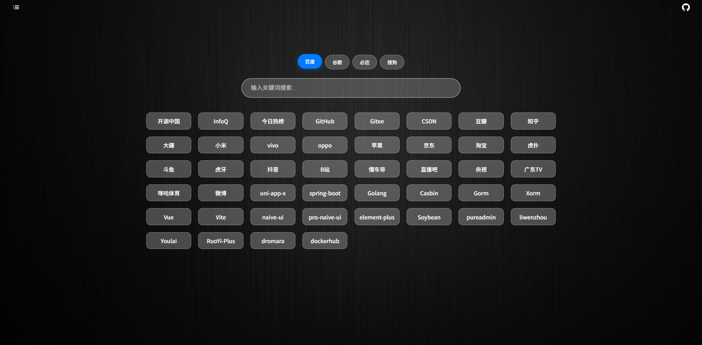
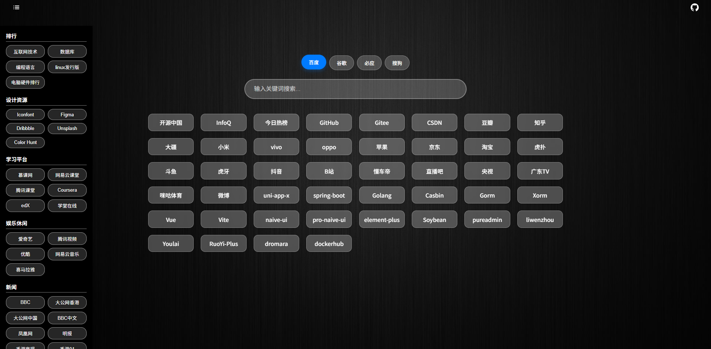
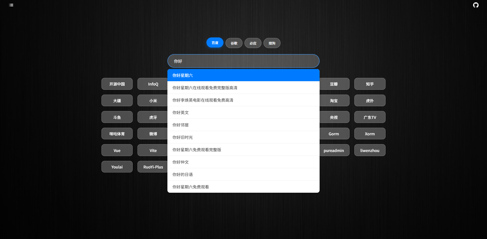
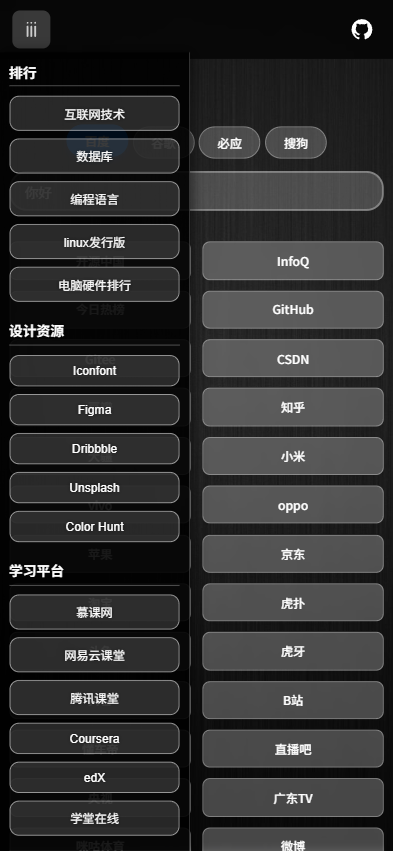

# 极简导航网站

极简导航网站，使用现代前端技术栈，提供快速、响应式的网站导航体验。

## 效果

[demo](https://nav.oby.ink)










## 配置

配置网站

请编辑 `src/sites.ts` 文件。

```ts
// 常用网站（置顶）
export const pinnedSites: Site[] = [
  { name: '开源中国', url: 'https://www.oschina.net/' },
  { name: 'InfoQ', url: 'https://www.infoq.cn/' },
  { name: '今日热榜', url: 'https://tophub.today/' },
  { name: '知乎', url: 'https://www.zhihu.com' },
  { name: 'GitHub', url: 'https://github.com' },
]

// 侧边栏网站分类
export const categories: Category[] = [
  {
    // 分类名称
    name: '开发工具',
    // 分类网站
    sites: [
      { name: 'GitHub', url: 'https://github.com' },
      { name: 'Stack Overflow', url: 'https://stackoverflow.com' },
      { name: 'MDN', url: 'https://developer.mozilla.org/zh-CN/' },
      { name: '菜鸟教程', url: 'https://www.runoob.com' },
      { name: 'Vue.js', url: 'https://vuejs.org' },
      { name: 'React', url: 'https://reactjs.org' },
      { name: 'Angular', url: 'https://angular.io' },
    ],
  },
]

```


配置壁纸

上传图片到 `public\assets` 目录下, 然后编辑 `src\App.vue` 文件的css部分，如下

```vue
background-image: url('./assets/dark.jpeg');
```

## 技术栈

- [Vue 3](https://v3.vuejs.org/)
- [Vite](https://vitejs.dev/)
- [TypeScript](https://www.typescriptlang.org/)
- [Pinia](https://pinia.vuejs.org/)

## 功能特性

- 🚀 极速加载 - 基于 Vite 构建
- 📱 响应式设计 - 适配各种设备
- 🧠 状态管理 - 使用 Pinia 进行状态管理
- 🔍 搜索功能 - 集成多种搜索引擎
- 💡 搜索建议 - 支持实时搜索建议
- ⚡️ 现代化开发体验 - TypeScript + Vue 3 组合式 API

## 开发

> 推荐：node >= 20

```bash
# 拉取代码
git clone https://github.com/BingoEco/simple-navsite.git

# 安装依赖
cd simple-navsite
pnpm install

# 启动开发服务器
pnpm dev

# 构建生产版本
pnpm build

# 预览生产构建
pnpm preview
```

## 部署到 Vercel

1. 将项目推送到 GitHub/GitLab/Bitbucket 仓库
2. 登录 [Vercel](https://vercel.com/)
3. 点击 "New Project"
4. 导入你的项目仓库
5. Vercel 会自动检测这是一个 Vite 项目并设置正确的构建设置：
   - 构建命令: `pnpm build`
   - 输出目录: `dist`
   - Node.js 版本: 20+

也可以部署到任何支持静态文件托管的服务，如 GitHub Pages 等。

## 部署到Docker

构建 Docker 镜像：

```
docker build -t my-nav-site .
```
运行容器：
```
docker run -d -p 8080:80 my-nav-site
```
或使用docker-compose一键部署

```
docker-compose up -d
```

访问：http://localhost:8080

## 许可证

MIT
